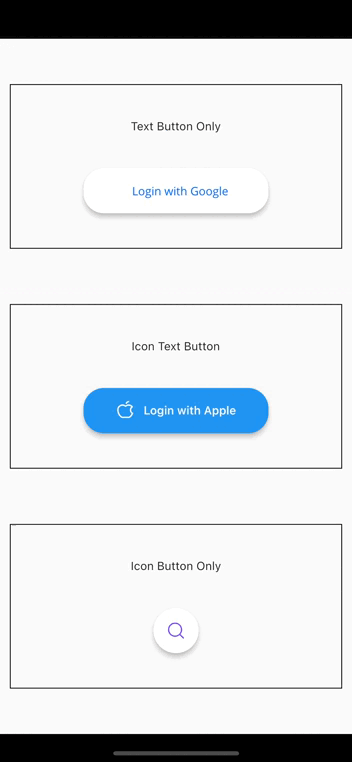
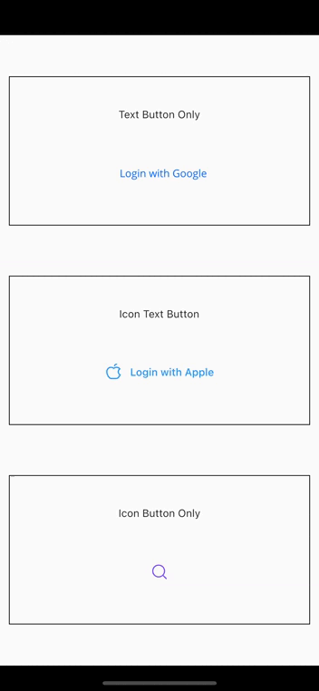

## loading icon button

with Card             |  without Card
:-------------------------:|:-------------------------:
  |  

## Installation

   Add this to your pubspec.yaml:

    dependencies:
        loading_icon_button: ^0.0.2
## Usage
### Import
    import 'package:loading_icon_button/loading_icon_button.dart';

### Simple Implementation
```dart
 final LoadingButtonController _btnController = LoadingButtonController();

  void buttonPressed() async {
    Future.delayed(const Duration(seconds: 1), () {
      _btnController.success();
      Future.delayed(const Duration(seconds: 1), () {
        _btnController.reset();
      });
    });
  }

  LoadingButton(
    child: const Text('Login with Apple'),
    iconData: PhosphorIcons.appleLogo,
    onPressed: () => buttonPressed(),
    controller: _btnController,
  );
```

Properties of IconLoadingButton:

* `duration` - The duration of the button animation
* `loaderSize` - The size of the CircularProgressIndicator
* `animateOnTap` -  Whether to trigger the loading animation on the tap event
* `resetAfterDuration` - Reset the animation after specified duration, defaults to 15 seconds
* `errorColor` - The color of the button when it is in the error state
* `successColor` - The color of the button when it is in the success state
* `successIcon` - The icon for the success state
* `failedIcon` - The icon for the failed state
* `iconColor` - The icon color for the button
* `showBox` - The visibility of the box(Card)


## Contributions
All contributions are welcome!

## Thanks to

RoundedLoadingButton  ```rounded_loading_button``` 
https://pub.dev/packages/rounded_loading_button

IconLoadingButton  ```icon_loading_button``` 
https://pub.dev/packages/icon_loading_button
